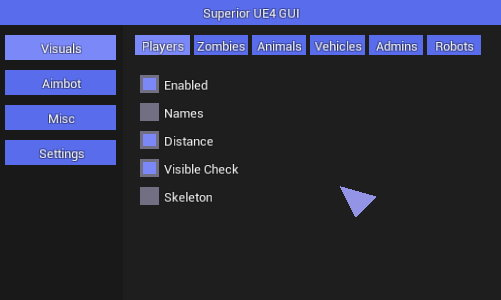
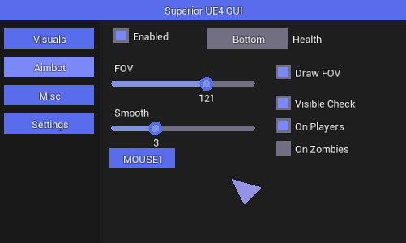
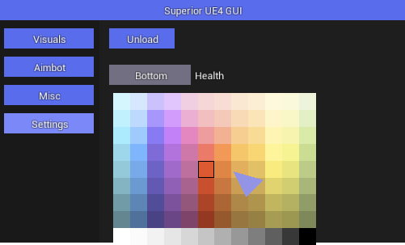
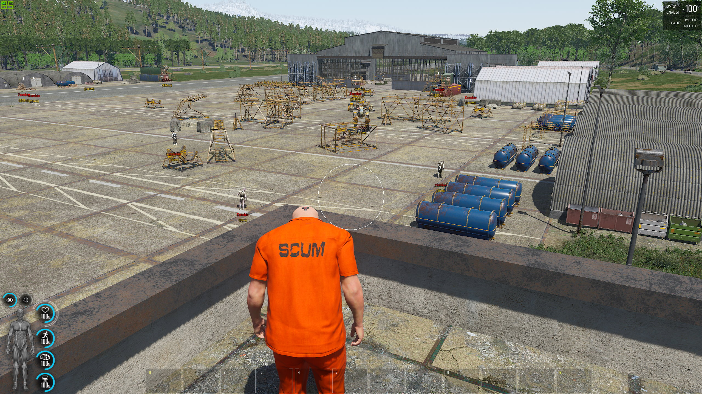

# ue4-canvas-gui

It's a simple Canvas GUI for Unreal Engine 4 with mouse operation.

Included elements:
Rendering Text (left/center);
Rendering Rects;
Rendering Circles (filled and not);
Button, Slider, Checkbox, Combobox, Hotkeys and ColorPicker.

Implemented a simple post-render system to draw on top of menu and all.

Screenshots with default style: 

 

 

 
Ingame render

